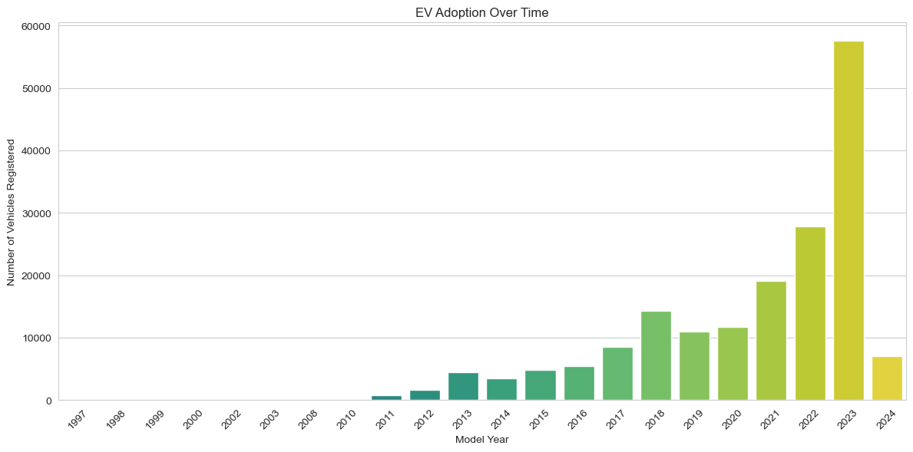

# 🚗 Electric Vehicle (EV) Market Analysis & Growth Forecast ⚡

## 📊 Project Overview

This project is an in-depth analysis of the US Electric Vehicle population, using a dataset of over 177,000 vehicle registrations. The goal is to uncover key trends in EV adoption, identify market leaders, and forecast future market growth using Python and its data science libraries.

This analysis explores the following key questions:
- How has EV adoption evolved over the years?
- What are the most popular EV types, manufacturers, and models?
- Where are the geographic hotspots for EV ownership?
- How has battery technology impacted the average electric range over time?
- What is the estimated market size for the next 5 years?

---

## 📈 Key Insights & Visualizations

#### 1. Explosive Market Growth
EV adoption has been accelerating since 2016, with 2023 seeing a massive spike in new registrations. My forecast shows this exponential trend is set to continue.

#### 2. Tesla's Market Dominance 👑
Tesla is the undisputed market leader. The Model Y and Model 3 are the most popular EVs by a significant margin, showcasing strong brand loyalty and consumer preference.

#### 3. Geographic Hotspots 🗺️
EV ownership is highly concentrated in specific areas. King County, WA (home to Seattle) is a major hotspot, with far more registrations than surrounding counties.

#### 4. The Rise of All-Electric 🔋
Battery Electric Vehicles (BEVs) are overwhelmingly more popular than Plug-in Hybrid Electric Vehicles (PHEVs). This suggests consumers are confidently making the full switch to electric.

---

## 🛠️ Technologies & Libraries Used

- **Language:** Python 3
- **Libraries:**
  - **Pandas:** For data manipulation and analysis.
  - **NumPy:** For numerical operations.
  - **Matplotlib & Seaborn:** For data visualization and creating charts.
  - **SciPy:** For curve fitting and building the exponential growth model.
- **Environment:** Jupyter Notebook

---

## 🚀 How to Use

To run this analysis yourself:
1. Clone this repository to your local machine.
2. Ensure you have Jupyter Notebook and the required libraries installed.
3. Open the `ev_analysis.ipynb` notebook.
4. Run the cells sequentially. The notebook uses the included `Electric_Vehicle_Population_Data.csv` file.

---

## 📄 Data Source
The dataset used for this analysis is the "Electric Vehicle Population Data," sourced publicly and included in this repository.
